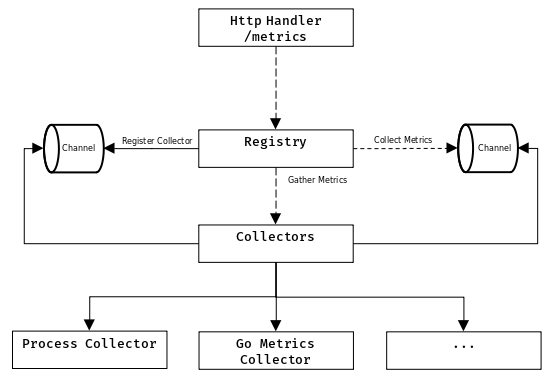
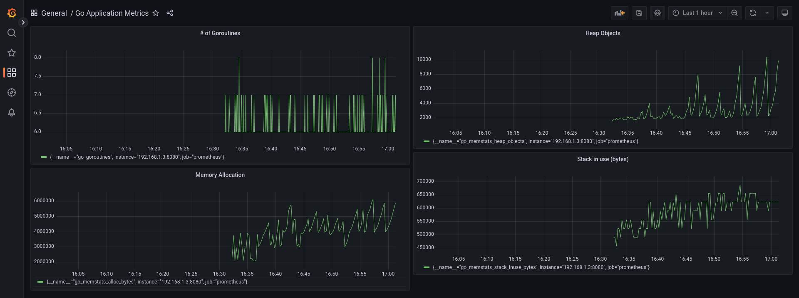

## Go metrics with Prometheus

## The Code

Source `main.go` contains the code to run the application to serve Prom metrics on port `8080`, looks 
like the following

```go
http.Handle("/metrics", promhttp.Handler())
log.Fatal(http.ListenAndServe("0.0.0.0:8080", nil))
```

## How it looks 

Running locally Grafana and Prometheus using Docker:

```
docker run -d -p 3000:3000 grafana/grafana-oss
```

```
docker run \
-p 9090:9090 \
-v $PWD/prometheus.yml:/etc/prometheus/prometheus.yml \
prom/prometheus:latest
```

The configuration file `prometheus.yml` contains config for reading the metrics from the Go application
on port `8080`

```
scrape_configs:
  - job_name: "prometheus"

    static_configs:
      - targets: ["192.168.1.3:8080"]
```

Replace `192.168.1.3` with your local machine IP address


## client_golang internal

Prometheus provide Go client library that makes it easy to report Go's runtime metrics that can be consumed 
easily. Internally the architecture looks like the following



`Registry` is the central piece that takes care of the collectors including gathering and collecting
all metrics that are needed when the `/metrics` endpoint is called.

The library utilize Go channels, giving it the ability to collect metrics across different Go routines quicky.


## How it looks 

Following is example of metrics that can be viewed using Grafana dashboard


